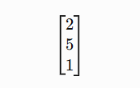
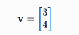
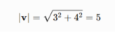
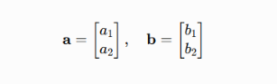
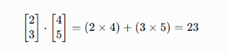
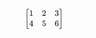

## Final Linear Algebra Review

Without looking at your notes, explain:
### 1. What is a vector?

A vector is an object that has both **magnitude (size)** and **direction.**

For example:

- A car moving 60 km/h east is a vector because it has speed (magnitude) and direction (east).

- In AI and data science, a vector is often represented as a list of numbers:

where each value represents a feature of a data point.

### 2. What is vector magnitude?

The magnitude of a vector is its **length** or **size.**

For a vector:

its magnitude is:

The magnitude tells us **how large or strong** the vector is, regardless of its direction.

### 3. What is a dot product?

The dot product combines two vectors into a single number.

For vectors

the dot product is:

Example:

It is commonly used to:
- Measure similarity between vectors
- Compute projections
- Perform calculations in machine learning and neural networks

### 4. What is a matrix?

A matrix is a rectangular arrangement of numbers in rows and columns.

Example:

Matrices are used to:
- Store datasets
- Represent transformations
- Perform calculations in machine learning and deep learning

### 5. Why does matrix multiplication require compatible dimensions?

Matrix multiplication works by multiplying **rows of the first matrix** with **columns of the second matrix.**

Therefore:
- If matrix A is m×n
- Matrix B must be n×p

The number of columns in the first matrix must equal the number of rows in the second matrix.

Example:

- 2×3 × 3×4 ✅ Possible
- 2×3 × 2×4 ❌ Not possible

This rule ensures that every row has a matching column to compute each entry of the result.

### 6. What is a matrix transformation?

A matrix transformation is the process of multiplying a vector by a matrix to change the vector.

A transformation can:

- Rotate a vector
- Stretch or shrink it (scaling)
- Reflect it
- Shear it

In AI, neural networks repeatedly apply matrix transformations to convert raw input data into useful representations for prediction.

### 7. What is an eigenvector (intuitively)?

An **eigenvector** is a special vector whose **direction does not change** when a matrix transformation is applied.

Instead of changing direction, it only becomes:

- Longer,
- Shorter, or
- Reversed.

The amount by which it is stretched or shrunk is called the **eigenvalue.**

**Intuition:** Imagine a rubber sheet being stretched. Most arrows drawn on it change both their length and direction. An eigenvector points along one of the special directions that only gets stretched or compressed, without turning.